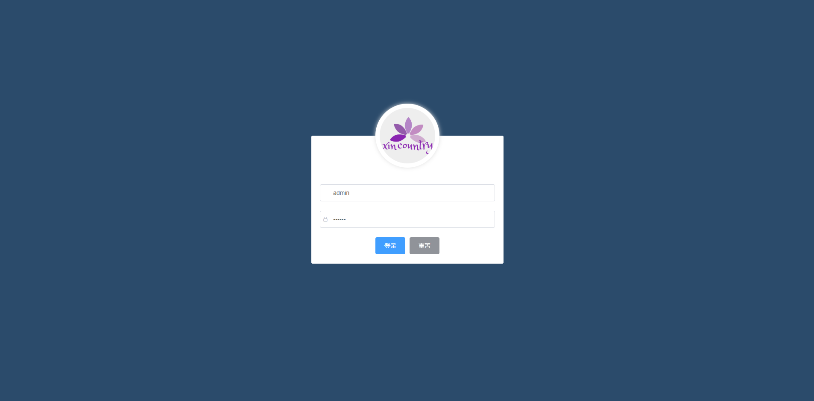

## 说明

> 如果对您对此项目有兴趣，可以点 "Star" 支持一下 谢谢！🙏

> 或者您可以 "follow" 一下，我会不断开源更多的有趣的项目 👻

> 如有问题请直接在 Issues 中提，或者您发现问题并有非常好的解决方案，欢迎 PR 💯

> 开发环境: window10专业版; nodejs v12.13.1; vsCode

> 更多探索：[低仿去哪儿移动app](https://github.com/lumengxin/Travel.git)    [包含前后端的低仿亚马逊购物](https://github.com/lumengxin/vue-pc-shop.git)


### 技术栈
vue + vue-router + vue-table-with-tree-grid + vue-quill-editor + echarts + nprogress + element-ui


### 项目运行

```
git clone https://github.com/lumengxin/vue-shop.git
npm install
npm server                  // 运行
npm run lint                // 格式化代码
npm run build               // 打包上线
```

### 更多阅读

- [笔记](./docs/read.md)

## 项目预览：

**效果展示：**

<div style="display:flex;flex-wrap:wrap;">
    
    
</div>

